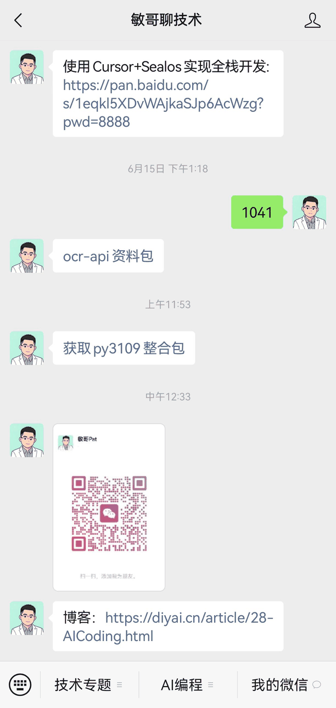

# mg-autotest

基于 **OpenCV 模板匹配** + **uiautomator2** 的 Android UI 自动化测试框架。支持截图框选模板、可视化编排工作流、命令行执行，结合图像识别实现无侵入的自动化操作。

---

## 演示案例

| 工具 | 效果 |
|------|------|
| **📸 模板截图工具** — 浏览器框选截图保存为模板 |  |
| **🧩 工作流编排工具** — 拖拽模板编排操作步骤 |  |
| **🚀 命令行执行 + 屏幕录制** — 工作流自动执行并录制为 GIF |  |

从截取模板 → 编排步骤 → 自动执行，全链路可视化操作。

---

## 功能特性

| 功能 | 说明 |
|------|------|
| 📸 **Web 截图工具** | 浏览器实时预览设备屏幕，拖拽框选保存为 PNG 模板 |
| 🧩 **可视化工作流编排** | 拖拽模板编排操作步骤，支持排序/增删/参数调节 |
| 🚀 **命令行执行器** | 加载 JSON 工作流执行，支持屏幕录制 GIF、遇错继续 |
| 🖼️ **OpenCV 模板匹配** | 基于 TM_CCOEFF_NORMED 的屏幕元素定位 |
| 🚨 **弹窗自动监控** | 后台 watcher 自动处理权限/升级/广告弹窗 |
| 📹 **屏幕录制** | 多帧截图合成 GIF，可调帧率/分辨率/色深 |
| 🔧 **Python 脚本导出** | 工作流一键导出为可独立运行的 Python 脚本 |

---

## 快速开始

### 环境要求

- Python 3.9+（推荐 [py3109](https://diyai.cn/freeResource.html)）
- Android 设备 / 模拟器（已开启 USB 调试）
- **uiautomator2 已在设备上初始化**（见步骤 2）

### 安装

```bash
# 1. 初始化设备（仅首次需要）
D:/aDisk/py3109-autotest/python.exe -m uiautomator2 init

# 2. 安装 Python 依赖
install_depends.bat
```

### 配置设备

编辑 `config.py`，根据你的连接方式修改：

```python
DEVICE_CONNECT_METHOD = "usb"          # usb | adb | wifi
DEVICE_SERIAL = "FPP0222225010815"     # 多设备时指定序列号
DEVICE_ADDRESS = None                  # WiFi 模式: "192.168.1.x:5555"
```

---

## 📸 截图模板 (Template Capture)

截取屏幕上需要点击的区域作为模板图片，供后续匹配使用。

```bash
create_template.bat
# 等价于: D:/aDisk/py3109-autotest/python.exe scripts/capture_template_web.py
```

启动后浏览器自动打开 `http://127.0.0.1:18989`

**操作流程：**
1. 页面显示设备实时截图
2. **鼠标拖拽**框选目标区域（如按钮、图标）
3. 在 `模板名称` 输入框命名（默认自动生成 `template_20260628_124719`）
4. 点击 **保存模板** 或 `Ctrl+S`
5. 保存后自动测试匹配，结果显示在页面下方

**快捷键：**

| 快捷键 | 功能 |
|--------|------|
| `R` | 刷新截图 |
| `Ctrl+S` | 保存选区为模板 |
| `T` | 测试当前模板匹配 |
| `C` | 点击匹配到的位置 |
| `ESC` | 清除选区 |

**模板匹配测试区：**
- 选择已保存的模板 → 点击 **测试匹配** → 橙色框标记匹配位置
- 调整 **阈值** (默认 0.8) 控制匹配精度
- 点击 **👆 点击** 实地验证匹配是否正确

---

## 🧩 工作流编排 (Workflow Builder)

在浏览器中可视化编排自动化操作步骤序列。

```bash
builder_workflow.bat
# 等价于: D:/aDisk/py3109-autotest/python.exe scripts/workflow_builder.py
```

启动后浏览器自动打开 `http://127.0.0.1:18990`

**界面组成：**
- **左侧面板** — `templates/` 目录下的所有模板缩略图
- **右侧面板** — 工作流步骤列表（拖拽或点击添加）

**支持的操作类型：**

| 类型 | 图标 | 参数 | 说明 |
|------|------|------|------|
| `click` | 模板图 | `threshold`, `timeout`, `offsetX/Y` | 在屏幕查找模板并点击 |
| `text` | ⌨ | `text` | 输入文本 |
| `long_click` | 模板图 | `threshold`, `timeout`, `offsetX/Y`, `duration` | 查找模板并长按 |
| `swipe` | ⇅ | `sx`, `sy`, `ex`, `ey`, `duration` | 从 (sx,sy) 滑到 (ex,ey) |
| `wait` | ⏱ | `seconds` | 等待指定秒数 |
| `back` | ↩ | — | 按下返回键 |
| `screenrecord` | ● | — | 标记录制起点（配合 `--record`） |

**操作流程：**
1. **添加步骤** — 拖拽左侧模板到右侧，或点击顶部 `+ Click` / `+ Text` 等按钮
2. **配置参数** — 点击步骤卡片的输入框调整阈值、超时、偏移等
3. **排序** — 使用 ▲ ▼ 按钮调整步骤顺序
4. **运行** — 点击步骤旁的 ▶ 单步测试，或点击 **▶ Run All** 全量执行
5. **保存/加载** — `Save` / `Load` 按钮管理 JSON 工作流文件
6. **导出** — `Export Script` 导出为独立 Python 脚本

**批量操作：**
- `Enable All` — 启用所有步骤
- `Invert` — 反转启用/禁用状态
- `Del Off` — 一键删除所有已禁用的步骤

---

## 🚀 命令行执行 (Workflow Runner)

无需浏览器，直接在命令行中加载并执行工作流 JSON 文件。

```bash
# 交互式选择工作流
D:/aDisk/py3109-autotest/python.exe scripts/workflow_runner.py

# 指定工作流文件
D:/aDisk/py3109-autotest/python.exe scripts/workflow_runner.py workflows/workflow_demo.json

# 列出可用工作流
D:/aDisk/py3109-autotest/python.exe scripts/workflow_runner.py --list
```

### 命令行参数

| 参数 | 说明 |
|------|------|
| `workflow` | 工作流 JSON 文件路径（留空则交互选择） |
| `--list` | 列出 workflows/ 目录下所有工作流 |
| `--continue` | 遇错时继续执行，不停止 |
| `--record` | 录制屏幕操作，保存为 GIF 到 screenrecords/ 目录 |
| `--initenv` | 执行前等待 `wx_filetranshelper.png` 出现（用于恢复初始环境） |

### 执行示例

```bash
# 基本执行
python scripts/workflow_runner.py my_flow.json

# 录制屏幕 GIF + 遇错继续
python scripts/workflow_runner.py my_flow.json --record --continue

# 恢复环境后再执行（用于微信小程序等场景）
python scripts/workflow_runner.py my_flow.json --initenv --record
```

---

## 📁 工作流 JSON 格式

工作流文件是 JSON 格式，结构如下：

```json
{
  "name": "workflow_demo.json",
  "steps": [
    {
      "type": "click",
      "enabled": true,
      "template": "button_ok.png",
      "desc": "点击确定按钮",
      "threshold": 0.8,
      "timeout": 10,
      "offsetX": 0,
      "offsetY": 0
    },
    {
      "type": "text",
      "enabled": true,
      "desc": "输入搜索内容",
      "text": "关键词"
    },
    {
      "type": "swipe",
      "enabled": true,
      "desc": "上滑加载更多",
      "sx": 100,
      "sy": 800,
      "ex": 100,
      "ey": 300,
      "duration": 0.3
    },
    {
      "type": "wait",
      "enabled": true,
      "desc": "等待加载",
      "seconds": 2
    },
    {
      "type": "back",
      "enabled": true,
      "desc": "返回上一页"
    },
    {
      "type": "screenrecord",
      "enabled": true,
      "desc": "开始录制"
    }
  ]
}
```

公共字段：
- `type` — 步骤类型（click / text / long_click / swipe / wait / back / screenrecord）
- `enabled` — 是否启用（`false` 时跳过该步骤）
- `desc` — 步骤描述

类型特有字段见 [工作流编排](#-工作流编排-workflow-builder) 章节的参数表。

---

## ⚙️ 配置参考 (`config.py`)

```python
# ── 设备连接 ──
DEVICE_CONNECT_METHOD = "usb"        # 连接方式
DEVICE_ADDRESS = None                 # WiFi 地址
DEVICE_SERIAL = "FPP0222225010815"    # 设备序列号

# ── 图像匹配 ──
DEFAULT_THRESHOLD = 0.8               # 默认匹配阈值 (0~1)
DEFAULT_TIMEOUT = 10                  # 默认超时 (秒)
RETRY_INTERVAL = 0.5                  # 重试间隔 (秒)
WAIT_ELEMENT_INTERVAL = 1.0           # 元素轮询间隔 (秒)

# ── 日志 ──
LOG_LEVEL = "INFO"                    # DEBUG / INFO / WARNING / ERROR
LOG_FORMAT = "%(asctime)s - %(levelname)s - %(message)s"
LOG_FILE = None                       # 日志文件路径（None=仅控制台）

# ── 模板路径 ──
TEMPLATE_DIR = "templates"
RESOLUTION_TEMPLATE_DIRS = {          # 多分辨率支持
    "1080x1920": "templates/1080x1920",
    "1440x2560": "templates/1440x2560",
}

# ── 截图 & 录制 ──
SCREENSHOT_DIR = "screenshots"
SAVE_SCREENSHOT_ON_FAILURE = True     # 失败时自动截图
STATUS_BAR_HEIGHT = 120               # 录制时裁剪状态栏（像素）
RECORD_INTERVAL = 0.5                 # 录制备帧间隔 (秒)
RECORD_RESIZE_RATIO = 0.5             # GIF 缩放比例
RECORD_GIF_COLORS = 128               # GIF 颜色数 (≤256)
```

---

## 🧱 项目架构

```
mg-autotest/
├── main.py                          # 主入口（示例自动化流程）
├── config.py                        # 全局配置
├── requirements.txt                 # Python 依赖
│
├── core/                            # 核心模块
│   ├── device.py                    # 设备连接与管理
│   ├── image_matcher.py             # OpenCV 模板匹配（查找/点击/等待/截图）
│   ├── watchers.py                  # 弹窗自动监控（XPath 文本匹配）
│   ├── helpers.py                   # 辅助操作（文本输入/滑动/坐标点击）
│   └── logger.py                    # 日志配置
│
├── scripts/                         # 工具脚本
│   ├── capture_template_web.py      # Web 版截图工具（端口 18989）
│   ├── workflow_builder.py          # Web 版工作流编排（端口 18990）
│   └── workflow_runner.py           # 命令行工作流执行器
│
├── workflows/                       # 工作流 JSON 文件
├── templates/                       # 模板 PNG 图片
├── assets/                          # 项目截图（README 配图）
├── screenshots/                     # 运行截图
└── screenrecords/                   # 录制的 GIF 文件
    create_template.bat              # 启动截图工具
    builder_workflow.bat             # 启动工作流编排
    install_depends.bat              # 安装 Python 依赖
```

### 核心 API 速览

**`core/image_matcher.py`**
| 函数 | 功能 |
|------|------|
| `find_image(d, template, threshold, timeout)` | 查找模板位置，返回坐标和置信度 |
| `find_and_click(d, template, threshold, timeout, offset_x, offset_y)` | 查找并点击模板 |
| `wait_for_image(d, template, threshold, timeout)` | 等待模板出现 |
| `wait_for_image_gone(d, template, threshold, timeout)` | 等待模板消失 |
| `click_if_exists(d, template, threshold, timeout)` | 存在即点击（弹窗用） |
| `save_screenshot(d, name)` | 保存截图到文件 |

**`core/helpers.py`**
| 函数 | 功能 |
|------|------|
| `wait_for_text(d, text, timeout)` | 等待文本出现 |
| `wait_for_text_gone(d, text, timeout)` | 等待文本消失 |
| `input_text(d, resource_id, text, ...)` | 输入文本到指定元素 |
| `swipe_up / swipe_down / swipe_left / swipe_right` | 四个方向滑动 |
| `click_coordinate(d, x, y)` | 点击屏幕坐标 |
| `get_text(d, resource_id, timeout)` | 获取元素文本 |

**`core/watchers.py`**
- 内置弹窗规则：允许权限、确定、取消、同意、拒绝、知道了、以后再说、升级提示
- 支持通过 `custom_rules` 参数扩展自定义规则
- 持久后台监控，执行步骤时自动处理弹窗

---

## 💡 典型场景

### 微信小程序自动化

```python
# config.py 中的参数参考
# 1. 截取小程序入口图标 → 保存为模板
# 2. 编排工作流：点击入口 → 等待加载 → 操作页面 → 返回
# 3. 用 --initenv 配合 wx_filetranshelper.png 确保从桌面开始
```

### 批量安装 / 升级测试

```bash
# 编排安装流程 → 导出 Python 脚本
# 通过 --record 录制操作过程，便于回溯问题
python scripts/workflow_runner.py install_flow.json --record
```

### 回归测试

```bash
# 定时执行工作流，遇错自动停止并截图保存现场
python scripts/workflow_runner.py regression_flow.json --continue
```

---

## 常见问题

**Q: 模板匹配不到？**
- 降低 `threshold`（如 0.7），截取更大的模板区域
- 确保模板分辨率与设备分辨率一致
- 检查模板是否包含过多的无关背景

**Q: 多设备如何连接？**
- 在 `config.py` 中设置 `DEVICE_SERIAL` 指定序列号
- 通过 `adb devices` 查看已连接的设备序列号

**Q: 弹窗监控不生效？**
- watchers 基于 XPath 文本匹配，确认弹窗文字是否在内置规则中
- 在 `setup_watchers()` 的 `custom_rules` 参数中添加自定义规则

**Q: GIF 录制体积太大？**
- 调大 `RECORD_INTERVAL`（减少帧数）
- 调小 `RECORD_RESIZE_RATIO`（降低分辨率）
- 调小 `RECORD_GIF_COLORS`（减少颜色数）

---

## 许可证

[MIT](LICENSE)
