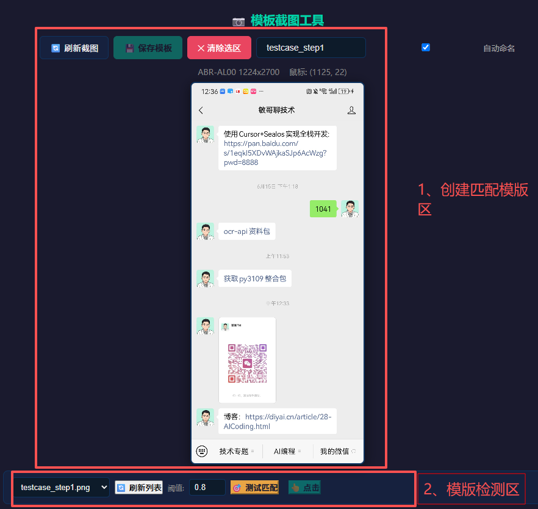
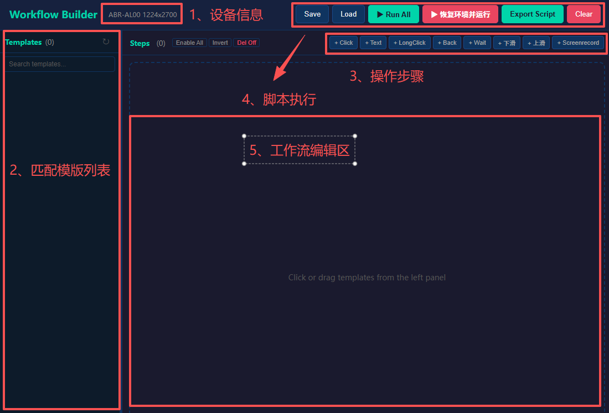

# mg-autotest
opencv+uiautomator+AI 实现自动化测试

## 使用方法
1、[下载py3109回复1031获取](https://diyai.cn/freeResource.html)后解压到D:\aDisk\python3109-autotest目录下

2、初始化设备和模板
```shell
D:/aDisk/py3109-autotest/python.exe -m uiautomator2 init
```

2、执行 install_depends.bat 安装依赖

3、录制脚本: create_template.bat


4、加载脚本并执行: builder_workflow.bat



## 功能列表
